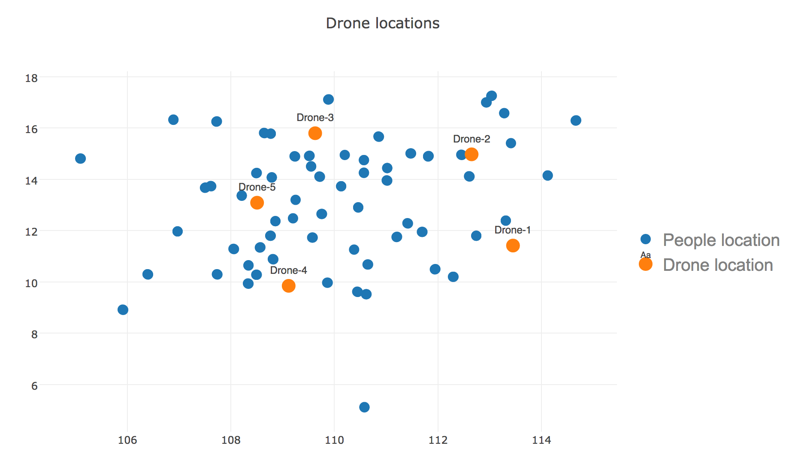
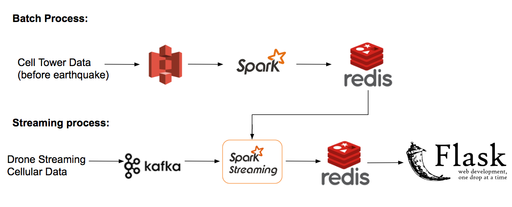

# Table of Contents

1. [Overview](README.md#Overview)
2. [Pipeline](README.md#Pipeline)
3. [Directory Structure](README.md#directory-structure)

## Overview
Following is my project for the Insight Data Engineering- Silicon Valley Summer 2017 fellowship.

[Project Slides](https://drive.google.com/open?id=1G0ONcg66ZTAPgp0zjokKmheT_lvf5OQEf1xcsjV-TeI)

[Demo Video](https://www.youtube.com/watch?v=OgiT5cNVn5U)

In this project, I implemented a data pipeline to analyze a stream of cellular signal collected from drone in an earthquake. I implemented K-Means and streaming K-Means algorithms to optimize the drone locations. There are 2000 events/sec ingested into the pipeline. 

## Pipeline

Historical cellular signal data is stored on Amazon S3, which I used for batch processes as well as simulated streams. 
For the batch part of the pipeline, I used Spark to process the data, which were then stored on Redis. On the streaming side, I emulated a stream by from local to Kafka, then processed the transactions with my Kafka Consumer. The results were also stored on Redis. My Flask application then queried the Redis database for the relevant data.

## Repository Structure

- `./src/` contains all relevant files for replicating the batch and streaming portions of the project

- `./sample-data` contains some sample cellular signal data
